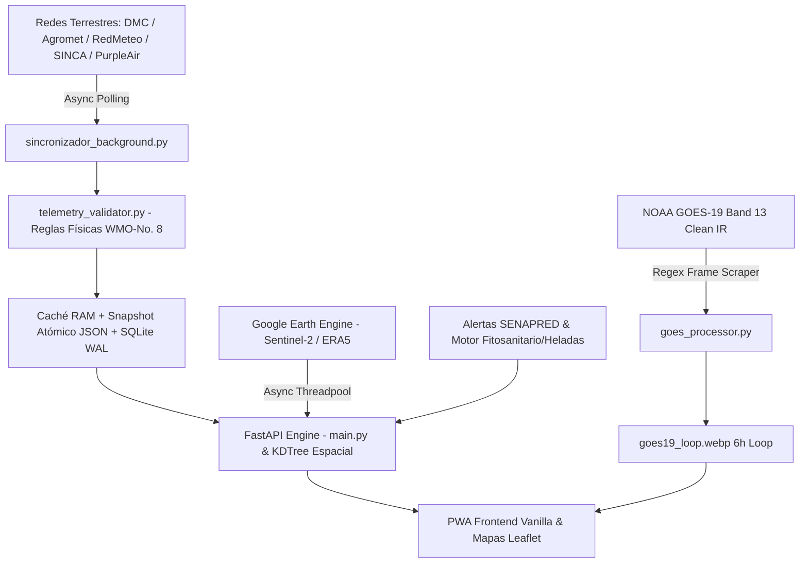

# 🌩️ MeteoPrecisa Chile

[](https://opensource.org/licenses/MIT)
[](https://www.python.org/)
[](https://fastapi.tiangolo.com/)
[](https://www.docker.com/)
[](https://library.wmo.int/)

**Plataforma Open-Source de Inteligencia Agrometeorológica Hiperlocal, Teledetección Satelital y Calidad del Aire para Chile.**

MeteoPrecisa unifica en tiempo real más de 700 estaciones meteorológicas terrestres públicas, ciudadanas y privadas a lo largo del territorio chileno (DMC, Agromet INIA, RedMeteo, SINCA MMA, PurpleAir), cruzándolas con imágenes satelitales GOES-19 NOAA en HD y análisis geoespacial de Google Earth Engine (Sentinel-2, MODIS, ERA5-Land).

Diseñado bajo principios de ingeniería de alta eficiencia (*Ponytail*), entrega respuestas HTTP en **<50ms** mediante indexación espacial KDTree y persistencia atómica híbrida en memoria y SQLite WAL.

---

## 🏗️ Arquitectura del Sistema



### 1. Ingesta Asíncrona y Validación Metrológica (WMO-No. 8)
- **`sincronizador_background.py`**: Loop asíncrono con control atómico `_SYNC_LOCK` que sondea periódicamente redes meteorológicas terrestres.
- **`telemetry_validator.py`**: Validador estricto de integridad física según la norma WMO-No. 8. Filtra centinelas de hardware (`9900`, `990`, `99`), valida consistencia psicrométrica ($T_d \le T$) y ajusta barometría para estaciones de alta montaña andina (hasta 500 hPa).

### 2. Teledetección y Radares Satelitales
- **`goes_processor.py`**: Descarga y compila en bucles WebP HD de 6 horas el canal infrarrojo limpio (Band 13) del satélite geoestacionario NOAA GOES-19.
- **`gee_service.py` & `gee_cache_db.py`**: Integración con Google Earth Engine para NDVI, temperatura superficial (LST) e índices hídricos con base de datos SQLite indexada en modo WAL.

### 3. API Servidor y Búsqueda Espacial KDTree
- **`main.py`**: API REST en FastAPI que utiliza árboles espaciales KDTree (`scipy.spatial.cKDTree`) sobre coordenadas esféricas para resolver la estación más cercana en submilisegundos ($O(\log N)$).

### 4. PWA Frontend Ultraligera
- **`static/`**: Interfaz unificada en HTML5/CSS3/JavaScript nativo sin sobrecargas de frameworks pesados, con soporte PWA offline vía Service Worker (`sw.js`) con estrategia *Cache-First*.

---

## 🚀 Despliegue Rápido con Docker (Recomendado)

El proyecto incluye configuración completa de Docker y Docker Compose para levantar el stack completo (FastAPI + TimescaleDB/PostGIS):

```bash
# 1. Clonar el repositorio
git clone https://github.com/elpabloultron/meteoprecisa-backend.git
cd meteoprecisa-backend

# 2. Configurar variables de entorno
cp .env.example .env

# 3. Levantar con Docker Compose
docker compose up --build -d
```

La aplicación estará disponible de inmediato en:
- **Web App / PWA:** `http://localhost:8000/`
- **Documentación Interactiva Swagger:** `http://localhost:8000/docs`
- **Métricas de Estado:** `http://localhost:8000/api/v1/status`

---

## 💻 Ejecución Local con Python (Entorno de Desarrollo)

### Prerrequisitos
- Python 3.11+
- Git

```bash
# Crear y activar entorno virtual
python3 -m venv .venv
source .venv/bin/activate

# Instalar dependencias
pip install -r requirements.txt

# Ejecutar suite de pruebas unitarias
pytest -v

# Iniciar servidor de desarrollo
uvicorn main:app --host 0.0.0.0 --port 8000 --reload
```

---

## 🧪 Calidad y Pruebas Automatizadas

El proyecto cuenta con 41 pruebas unitarias y de integración que validan:
- Conformidad con estándares WMO-No. 8.
- Búsqueda espacial KDTree y triangulación IDW.
- Latencia de respuesta en endpoints cacheados (<50ms).
- Persistencia atómica contra cortes de energía (`fsync` + `os.replace`).
- Modos WAL de SQLite y compresión GZIP.

Para ejecutar las pruebas:
```bash
pytest -v
ruff check .
```

---

## 📋 Endpoints Principales

| Método | Endpoint | Descripción |
| :--- | :--- | :--- |
| `GET` | `/api/v1/status` | Estado en vivo del motor, telemetría y conteo de estaciones. |
| `GET` | `/api/v1/clima-hiperlocal?lat={lat}&lon={lon}` | Telemetría en tiempo real con triangulación física y atribución de sensores. |
| `GET` | `/api/v1/estaciones` | Catálogo completo unificado de estaciones meteorológicas de Chile. |
| `GET` | `/api/v1/alertas/senapred` | Alertas meteorológicas y de emergencia oficiales activas. |
| `GET` | `/api/v1/satellite/latest-loop` | Metadatos y fotogramas del bucle infrarrojo GOES-19. |

---

## 🤝 Contribuciones y Open Source

Las contribuciones son bienvenidas. Por favor asegúrate de que todos los cambios pasen las pruebas (`pytest -v`) y el linter (`ruff check .`) antes de enviar un Pull Request.

## 📄 Licencia

Este proyecto está distribuido bajo la licencia **MIT**. Consulta el archivo [LICENSE](LICENSE) para más detalles.
