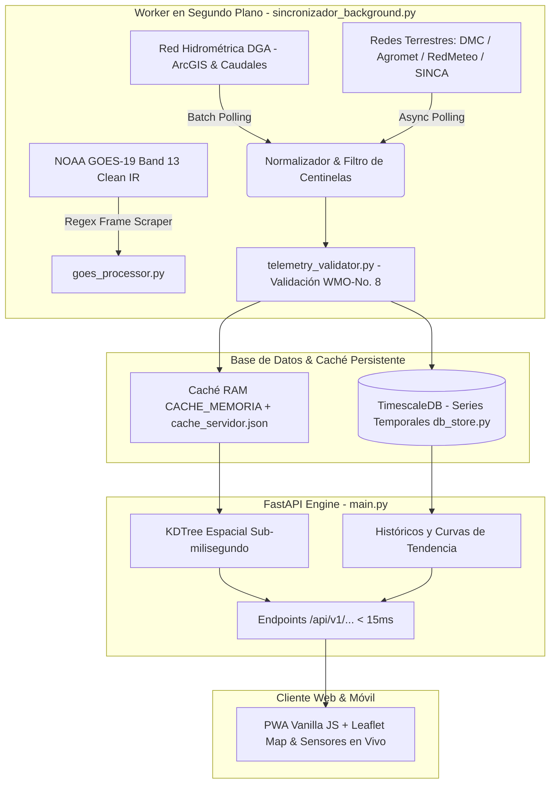

# 🌩️ MeteoPrecisa Chile

[](https://opensource.org/licenses/MIT)
[](https://www.python.org/)
[](https://fastapi.tiangolo.com/)
[](https://www.docker.com/)
[](https://www.timescale.com/)
[](https://github.com/elpabloultron/open-meteo-precisa-chile)
[](https://library.wmo.int/)

**Plataforma Open-Source de Inteligencia Hidrometeorológica, Teledetección Satelital y Calidad del Aire para Chile.**

MeteoPrecisa unifica en tiempo real **4.312 estaciones físicas** públicas, ciudadanas y oficiales a lo largo del territorio chileno:
- **DGA (Dirección General de Aguas):** 3.517 estaciones de la Red Hidrométrica Nacional (Fluviométricas, Embalses, Nivométricas, Meteorológicas y Sedimentométricas), con caudales instantáneos en $\text{m}^3/\text{s}$, tendencias de crecida, cotas y volúmenes de embalses en $\text{Hm}^3$.
- **DMC (Dirección Meteorológica de Chile):** Red de estaciones meteorológicas aeronáuticas y sinópticas oficiales.
- **Agromet INIA / RAN:** Red agroclimática nacional con sensores de temperatura, humedad, viento y precipitación.
- **RedMeteo.cl:** Red ciudadana y privada de estaciones automatizadas en todo el país.
- **SINCA MMA:** Red oficial de monitoreo de calidad del aire del Ministerio del Medio Ambiente (MP2.5, MP10, CO, $O_3$, $NO_2$).
- **PurpleAir:** Sensores hiperlocales de material particulado de alta resolución temporal.

Cruzado con bucles satelitales en alta resolución de **NOAA GOES-19** (Band 13 Clean IR), análisis geoespacial de **Google Earth Engine** (Sentinel-2, MODIS, ERA5-Land) y radar Doppler en vivo.

Diseñado bajo principios de ingeniería de alta eficiencia (*Ponytail*), entrega respuestas HTTP en **<15ms** mediante indexación espacial KDTree y una arquitectura desacoplada de almacenamiento local permanente (TimescaleDB / persistencia atómica).

---

## 🏛️ Principio Arquitectónico: Desacoplamiento Estricto Ingesta vs Servicio



> [!IMPORTANT]
> **Por qué no consultamos APIs externas durante las peticiones del usuario:**
> 1. **Prevención de Bloqueos (Anti-Rate-Limiting):** Si cada clic de usuario disparara consultas directas a los servidores de origen (DGA, DMC, etc.), las IPs serían bloqueadas por exceso de tráfico.
> 2. **Acumulación del Activo de Datos:** Almacenar de forma periódica en nuestra propia base de datos (TimescaleDB) nos permite conservar el historial hidrometeorológico real de Chile de forma soberana e independiente.
> 3. **Rendimiento Ultrarrápido:** El usuario jamás experimenta la latencia ni las caídas de servicios externos; todas las respuestas se sirven desde memoria y base local en menos de 15 ms.

### 🔍 Desglose Arquitectónico Detallado por Módulo

Haz clic en cada pestaña para explorar el funcionamiento técnico, flujos internos y algoritmos de cada componente del sistema:

<details>
<summary><b>📡 Módulo 1: Ingesta Asíncrona y Orquestación Multired (<code>sincronizador_background.py</code>)</b></summary>
<br>

El motor de sincronización de fondo opera como un worker asíncrono autónomo desacoplado del servidor web. Se ejecuta de manera continua con un ciclo programado (por defecto cada 900 a 3.600 segundos) protegido por un cerrojo atómico `_SYNC_LOCK` para evitar carreras de datos o sobrecarga de tareas simultáneas.

#### Conectores e Ingesta de Redes:
1. **DMC (Dirección Meteorológica de Chile):** Consume el servicio oficial EMA vía token (`getDatosRecientesRedEma`), extrayendo temperatura, humedad, presión, viento y precipitación acumulada de aeródromos y estaciones sinópticas. Además, ingesta periódicamente el boletín de pronóstico sinóptico oficial para todo el país.
2. **Agromet INIA / RAN (Red Agroclimática Nacional):** Extrae 422 estaciones agrometeorológicas. Implementa el algoritmo `clean_agromet_num` para depurar prefijos o desplazamientos centinela del hardware INIA (`9900`, `990`, `99`, `sin datos`), convirtiéndolos a valores físicos válidos o `None`.
3. **RedMeteo.cl:** Conexión a la API JSON de estaciones ciudadanas y privadas georreferenciadas (Davis Vantage, Ecowitt, etc.), validando coordenadas geográficas exactas en territorio chileno.
4. **SINCA MMA (Ministerio del Medio Ambiente):** Ingesta en tiempo real de 101 estaciones de monitoreo de calidad del aire a nivel nacional. Extrae concentraciones de material particulado fino ($PM_{2.5}$), grueso ($PM_{10}$) y contaminantes gaseosos ($CO$, $O_3$, $NO_2$, $SO_2$).
5. **PurpleAir:** Ingesta hiperlocal de micropartículas ciudadanas vía API REST para densificar la cobertura urbana y suburbana.
6. **SENAPRED:** Monitoreo y extracción de alertas tempranas preventivas, amarillas y rojas activas emitidas por el Servicio Nacional de Prevención y Respuesta ante Desastres.
7. **Radar Doppler RainViewer:** Integración periódica de mosaicos de reflectividad radar Doppler para seguimiento de tormentas en tiempo real.

Una vez finalizado el barrido multired, el worker compila el catálogo final, consolida la instantánea en memoria RAM (`CACHE_MEMORIA`), persiste atómicamente en disco (`cache_servidor.json`) y envía las series temporales a TimescaleDB.
</details>

<details>
<summary><b>💧 Módulo 2: Red Hidrométrica Nacional DGA (<code>dga_scraper.py</code> y <code>dga_telemetria.py</code>)</b></summary>
<br>

Incorpora de forma nativa e integral el monitoreo hidrológico de la **Dirección General de Aguas (MOP)**:

#### 1. Catálogo Hidrométrico Nacional (`dga_scraper.py`):
- Consulta de forma paginada los servicios oficiales de ArcGIS REST del MOP (`https://rest-sit.mop.gob.cl/arcgis/rest/services/DGA/Red_Hidrometrica/MapServer/0/query`).
- Indexa **3.517 estaciones vigentes** clasificadas en Fluviométricas, Lagos y Embalses, Nivométricas, Meteorológicas y Sedimentométricas.
- Normaliza los códigos BNA (ej. `05737019-K`) separando su código base (`05737019`) para indexación directa y sin ambigüedades.

#### 2. Extracción de Telemetría Oficial en Vivo (`dga_telemetria.py`):
- **Capa ALERTAS DGA (`MapServer/0`):** Ingesta 1.013 estaciones con umbrales de alerta de crecida, caudales instantáneos en $\text{m}^3/\text{s}$ (`mod_valor`), índices de crecida (`mod_indale`, `mod_alerta`) y timestamps de transmisión satelital.
- **Capa EMBALSES DGA (`MapServer/0`):** Monitoreo en vivo de los principales embalses de Chile (Recoleta, Cogotí, Ralco, Pangue, Colbún, Maule, Laja, etc.), extrayendo cota de nivel de agua (`nivel`), volumen acumulado en $\text{Hm}^3$ (`volumen`) y porcentaje de capacidad de llenado.
- **Enriquecimiento Fluviométrico por Lotes (`enriquecer_telemetria_dga_fluviometrica_lote`):** Procesa ríos, esteros y canales en segundo plano con un semáforo de concurrencia controlado (`asyncio.Semaphore(4)`) y timeouts estrictos de 2.5s. Extrae el caudal instantáneo en $\text{m}^3/\text{s}$, tendencia hidrológica (`estable`, `alza`, `baja`) y resumen de alerta, guardándolo directamente en TimescaleDB y en caché local.

#### 3. Garantía Anti-Baneo y Soberanía de Datos:
- Ninguna petición del usuario al navegar por la app o consultar el mapa realiza llamadas directas a las APIs del MOP. Toda la telemetría se extrae de manera centralizada y se sirve exclusivamente desde nuestra base de datos interna, protegiendo las IPs de bloqueos y construyendo un activo de datos histórico invaluable.
</details>

<details>
<summary><b>⚖️ Módulo 3: Validación Física y Metrológica WMO-No. 8 (<code>telemetry_validator.py</code>)</b></summary>
<br>

Toda medición física recibida pasa por un filtro de integridad termodinámica estricto basado en la guía técnica de la **Organización Meteorológica Mundial (WMO-No. 8)**:

1. **Consistencia Psicrométrica Inviolable:**
   - Termodinámicamente, la temperatura de punto de rocío ($T_d$) nunca puede superar a la temperatura ambiente ($T$). Si una estación transmite $T_d > T$ debido a condensación en el sensor o descalibración, el validador ajusta $T_d = T$ o descarta la medición corrupta.
   - Cálculo preciso del Déficit de Presión de Vapor (VPD) sobre agua líquida y sobre hielo para su uso en agricultura de precisión.
2. **Barometría de Alta Montaña Andina:**
   - La atmósfera estándar a nivel del mar oscila entre 950 y 1050 hPa. Sin embargo, en estaciones cordilleranas chilenas (como Portillo, Farellones o pasos andinos a > 3.000 msnm), la presión natural cae a 600–700 hPa. El validador ajusta dinámicamente los umbrales de presión hasta 500 hPa según la altitud de la estación, evitando falsos descartes de estaciones de altura.
3. **Plausibilidad Climática Territorial:**
   - **Temperatura:** Rango físico estricto de $-40^\circ\text{C}$ a $+60^\circ\text{C}$.
   - **Humedad Relativa:** Acotada estrictamente entre $0\%$ y $100\%$.
   - **Velocidad de Viento y Ráfagas:** Límite máximo de $250\text{ km/h}$; descarte de valores negativos o centinelas como $999.0$.
   - **Radiación Solar:** Validación cruzada contra la radiación teórica extraterrestre según el ángulo cenital solar para la hora y latitud exacta.
</details>

<details>
<summary><b>💾 Módulo 4: Capa de Persistencia Atómica y Base de Datos Histórica (<code>db_store.py</code> y <code>cache_store.py</code>)</b></summary>
<br>

El sistema implementa una arquitectura híbrida de persistencia optimizada para alta velocidad de lectura y almacenamiento a largo plazo:

1. **TimescaleDB / PostGIS (`db_store.py`):**
   - Motor relacional de series temporales (PostgreSQL 16) ejecutándose en el contenedor `meteoprecisa_db_prod`.
   - Almacena instantáneas periódicas de telemetría multi-red mediante tablas particionadas automáticamente por tiempo (`hypertables`).
   - Permite consultas analíticas complejas, extracción de curvas históricas de 24h/7d/30d y consultas geoespaciales con índices GiST sobre geometría PostGIS.
2. **Persistencia Atómica en Disco (`cache_store.py`):**
   - Guarda el estado completo de la red en `cache_servidor.json` mediante un protocolo atómico transaccional:
     1. Serialización en memoria a formato JSON estructurado.
     2. Escritura en archivo temporal en el mismo sistema de archivos.
     3. Forzado de sincronización física a disco vía `os.fsync`.
     4. Reemplazo atómico con `os.replace` (operación a nivel de inodo POSIX).
   - Este mecanismo garantiza que nunca exista un archivo de caché corrupto o a medio escribir ante cortes intempestivos de energía o reinicios del contenedor.
3. **Caché en Memoria RAM (`CACHE_MEMORIA`):**
   - Diccionario global en memoria con índice directo por ID de estación, alimentando las respuestas de la API en $< 15\text{ ms}$.
4. **SQLite WAL para Índices Satelitales (`gee_cache_db.py`):**
   - Base de datos SQLite configurada en modo `WAL` (Write-Ahead Logging) para permitir lecturas y escrituras concurrentes sin bloqueo para capas de teledetección.
</details>

<details>
<summary><b>🛰️ Módulo 5: Teledetección Satelital y Radar Doppler (<code>goes_processor.py</code> y <code>gee_service.py</code>)</b></summary>
<br>

Combina la observación espacial geoestacionaria con satélites de órbita polar para cobertura climática completa:

1. **NOAA GOES-19 Band 13 (Clean IR) (`goes_processor.py`):**
   - Procesa en tiempo real el canal infrarrojo de onda larga (10.3 µm) del satélite geoestacionario GOES-19 de la NOAA.
   - Extrae los fotogramas del sector sudamericano, recorta con precisión la cobertura de Chile continental, insular y cordillera, y compila un bucle animado WebP en alta definición de las últimas 6 horas (`/static/goes19_loop.webp`), optimizado para reproducción fluida en navegadores móviles.
2. **Google Earth Engine (GEE) (`gee_service.py` & `satellite_stac.py`):**
   - Conexión con el catálogo de Google Earth Engine para consultar colecciones satelitales de Copernicus Sentinel-2 (índice de vigor de vegetación NDVI), ERA5-Land (temperatura superficial del suelo) y NASA SMAP (humedad del suelo a diferentes profundidades).
   - Incluye un mecanismo de precalentamiento satelital no bloqueante al inicio del servidor para los principales valles agrícolas de Chile (Elqui, Limarí, Aconcagua, Maipo, Colchagua, Maule, Biobío).
3. **Capas Doppler de Radar Meteorológico:**
   - Integración con RainViewer para proyectar mosaicos Doppler georreferenciados directamente sobre el mapa interactivo Leaflet.
</details>

<details>
<summary><b>🧠 Módulo 6: Motor Espacial y de Inteligencia Agroclimática (<code>main.py</code> y <code>alertas_engine.py</code>)</b></summary>
<br>

1. **Resolución Espacial KDTree ($O(\log N)$):**
   - Convierte las coordenadas geográficas de las 4.312 estaciones en un árbol espacial `scipy.spatial.cKDTree`.
   - Cuando un usuario solicita el clima para cualquier coordenada GPS (`lat`, `lon`), el sistema encuentra en menos de $0.5\text{ ms}$ la estación física más cercana, la estación fluviométrica DGA más cercana y la estación de calidad del aire más próxima.
2. **Triangulación Ponderada IDW con Corrección Orográfica:**
   - Si no existe una estación física en la posición exacta, calcula el clima hiperlocal mediante interpolación por el Inverso de la Distancia (IDW) sobre las estaciones del entorno.
   - Aplica corrección orográfica de gradiente térmico vertical adiabático ($-6.5^\circ\text{C}$ por cada 1.000 metros de elevación) para reflejar fielmente los microclimas de precordillera y valles.
3. **Motor de Alertas Fitosanitarias y Heladas (`alertas_engine.py`):**
   - **Alerta de Helada Crítica:** Detección de heladas por radiación (cielo despejado, noche, calma de viento) y heladas advectivas (viento fuerte y masa de aire polar polar-antártica).
   - **Ventana de Deriva para Fumigación:** Evalúa condiciones de viento ($3\text{ a }15\text{ km/h}$), temperatura ($< 25^\circ\text{C}$) y humedad relativa ($> 50\%$) para autorizar o alertar sobre pulverizaciones agrícolas.
   - **Evapotranspiración de Referencia ($ET_0$):** Estimación mediante la ecuación física Penman-Monteith FAO-56.
   - **Inversión Térmica:** Cálculo empírico basado en gradientes térmicos locales, viento en calma y acumulación de partículas $PM_{2.5}$ reportadas por SINCA.
</details>

<details>
<summary><b>📱 Módulo 7: PWA Frontend Ultraligera y Experiencia Móvil (<code>static/</code>)</b></summary>
<br>

1. **Filosofía Vanilla JS (Cero Sobrecarga):**
   - Interfaz construida en HTML5, CSS3 moderno (con variables CSS y modo oscuro nativo) y JavaScript ES6+ modular.
   - No utiliza frameworks pesados (React, Vue, Angular), lo que se traduce en tiempos de carga inicial inferiores a 1 segundo y rendimiento fluido en dispositivos móviles de cualquier gama.
2. **Visualizador Espacial con Leaflet:**
   - Mapa interactivo con 4.312 estaciones representadas con marcadores de color diferenciados por red (DMC: Azul, Agromet INIA: Verde, RedMeteo: Violeta, SINCA: Rojo, DGA: Celeste).
   - Lógica de auto-encuadre inteligente (`fitBounds`) que ajusta la vista del mapa entre la ubicación del usuario y la estación seleccionada.
3. **Modal Completo de Sensores Físicos:**
   - Al hacer clic en cualquier estación del mapa o del dashboard, despliega una ficha técnica con todos sus sensores activos:
     - 🌡️ Temperatura actual, mínima y máxima del día.
     - 💧 Humedad relativa y punto de rocío ($T_d$).
     - 💨 Velocidad de viento, ráfaga máxima y dirección con rosa náutica interactiva (grados y rumbo cardinal, ej. `244° (SO)`).
     - 🌊 Caudal instantáneo en $\text{m}^3/\text{s}$ con tendencia hidrológica (para ríos y canales DGA).
     - 💧 Cota de nivel de agua, volumen en $\text{Hm}^3$ y porcentaje de llenado (para embalses).
     - ⚠️ Umbrales de alerta de crecida hidrológica DGA.
     - 📍 Coordenadas geográficas GPS y sector comunal.
4. **Módulo Agrícola y Ciclo Lunar:**
   - Modal interactivo con cálculo astronómico de la fase lunar actual y guía agronómica de labores sugeridas (siembra, poda, cosecha, riego) según la fase lunar.
5. **Soporte PWA Offline:**
   - Service Worker (`sw.js`) con política *Cache-First* para recursos estáticos y *Network-First* con fallback a caché para datos dinámicos. Permite instalar la app como aplicación nativa en Android e iOS.
6. **Accesibilidad y UX (WCAG 2.1 AA):**
   - Contraste cromático optimizado para legibilidad en exteriores bajo luz solar directa, zonas táctiles mínimas de 44x44px y navegación por teclado accesible.
</details>

---

## 🚀 Despliegue Rápido con Docker (Recomendado)

El proyecto incluye configuración completa de Docker y Docker Compose para levantar el stack completo (FastAPI + TimescaleDB/PostGIS):

```bash
# 1. Clonar el repositorio
git clone https://github.com/elpabloultron/open-meteo-precisa-chile.git
cd open-meteo-precisa-chile

# 2. Configurar variables de entorno (Cada usuario debe configurar sus propias llaves)
cp .env.example .env

# 3. Levantar con Docker Compose
docker compose up --build -d
```

### 🔐 Configuración de Variables de Entorno (`.env`)

MeteoPrecisa no incluye credenciales embebidas por seguridad. Cada usuario o desarrollador debe definir sus propias llaves en el archivo `.env`:

| Variable | Requerido / Opcional | Descripción |
| :--- | :--- | :--- |
| `PURPLEAIR_API_KEY` | Opcional | Clave de API de PurpleAir para sensores ciudadanos de calidad de aire (PM2.5). |
| `TOKEN_DMC` / `USUARIO_DMC` | Opcional | Credenciales oficiales de la Dirección Meteorológica de Chile. |
| `GCP_PROJECT_ID` / `GEE_KEY_PATH` | Opcional | Proyecto de Google Cloud y cuenta de servicio para Google Earth Engine (Sentinel-2, ERA5). |
| `EMAIL_USER` / `EMAIL_PASS` | Opcional | Credenciales IMAP para el lector de correos automatizado (`scripts/leer_correo.py`). |

> **Nota:** Si no se proporcionan API keys opcionales, el motor opera con las redes públicas abiertas (Agromet INIA, SINCA MMA, RedMeteo y NOAA GOES-19) mediante fallbacks automáticos sin fallar.

La aplicación estará disponible de inmediato en:
- **Web App / PWA:** `http://localhost:8000/`
- **Documentación Interactiva Swagger:** `http://localhost:8000/docs`
- **Métricas de Estado:** `http://localhost:8000/api/v1/status`

---

## 💻 Ejecución Local con Python (Entorno de Desarrollo)

### Prerrequisitos
- Python 3.11+
- Git

```bash
# Crear y activar entorno virtual
python3 -m venv .venv
source .venv/bin/activate

# Instalar dependencias
pip install -r requirements.txt

# Ejecutar suite de pruebas unitarias
pytest -v

# Iniciar servidor de desarrollo
uvicorn main:app --host 0.0.0.0 --port 8000 --reload
```

---

## 🧪 Calidad y Pruebas Automatizadas

El proyecto cuenta con 45 pruebas unitarias y de integración que validan:
- Conformidad con estándares WMO-No. 8.
- Búsqueda espacial KDTree y triangulación IDW.
- Latencia de respuesta en endpoints cacheados (<50ms).
- Persistencia atómica contra cortes de energía (`fsync` + `os.replace`).
- Modos WAL de SQLite y compresión GZIP.
- Protección y mitigación de seguridad (CSP, cabeceras HSTS, anti-traversal).

Para ejecutar las pruebas:
```bash
pytest -v
ruff check .
```

---

## 📋 Endpoints Principales

| Método | Endpoint | Descripción |
| :--- | :--- | :--- |
| `GET` | `/api/v1/status` | Estado en vivo del motor, telemetría y conteo unificado de estaciones (4.312). |
| `GET` | `/api/v1/clima-hiperlocal?lat={lat}&lon={lon}` | Telemetría en tiempo real con triangulación física, atribución y estación DGA más cercana. |
| `GET` | `/api/v1/estaciones` | Catálogo consolidado de 4.312 estaciones con tipo DGA y timestamps de actualización. |
| `GET` | `/api/v1/estacion/{id}` | Telemetría consolidada y metadatos de una estación física (DMC, Agromet, RedMeteo, SINCA, DGA). |
| `GET` | `/api/v1/alertas-senapred` | Alertas meteorológicas y de emergencia oficiales activas de SENAPRED. |
| `GET` | `/api/v1/satellite/latest-loop` | Metadatos y fotogramas del bucle infrarrojo GOES-19. |
| `GET` | `/api/v1/radar/doppler-tiles` | Capas Doppler de reflectividad de radar RainViewer en tiempo real. |
| `GET` | `/api/v1/historico/{id}` | Series temporales históricas persistidas en TimescaleDB. |

---

## 🤝 Contribuciones y Open Source

Las contribuciones son bienvenidas. Por favor asegúrate de que todos los cambios pasen las pruebas (`pytest -v`) y el linter (`ruff check .`) antes de enviar un Pull Request.

## 📄 Licencia

Este proyecto está distribuido bajo la licencia **MIT**. Consulta el archivo [LICENSE](LICENSE) para más detalles.
