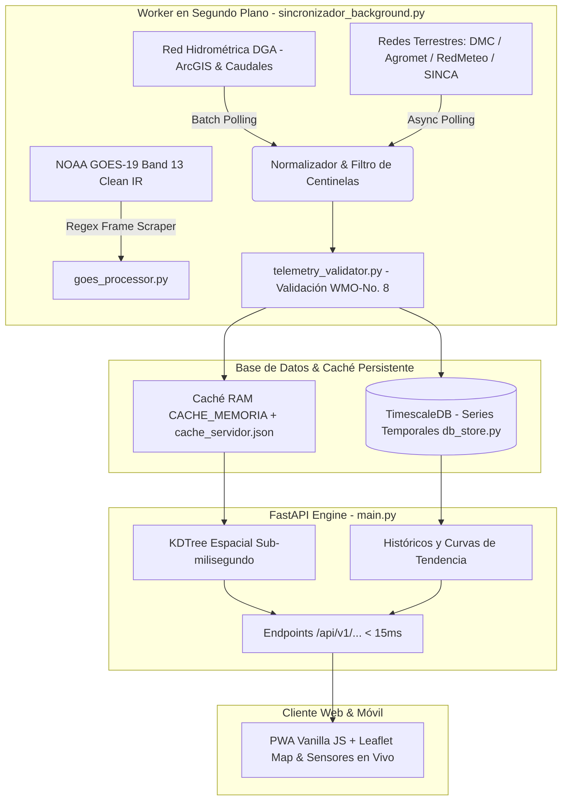

# 🌩️ MeteoPrecisa Chile

[](https://opensource.org/licenses/MIT)
[](https://www.python.org/)
[](https://fastapi.tiangolo.com/)
[](https://www.docker.com/)
[](https://www.timescale.com/)
[](https://github.com/elpabloultron/open-meteo-precisa-chile)
[](https://library.wmo.int/)

**Plataforma Open-Source de Inteligencia Hidrometeorológica, Teledetección Satelital y Calidad del Aire para Chile.**

MeteoPrecisa unifica en tiempo real **4.312 estaciones físicas** públicas, ciudadanas y oficiales a lo largo del territorio chileno:
- **DGA (Dirección General de Aguas):** 3.517 estaciones de la Red Hidrométrica Nacional (Fluviométricas, Embalses, Nivométricas, Meteorológicas y Sedimentométricas), con caudales instantáneos en $\text{m}^3/\text{s}$, tendencias de crecida, cotas y volúmenes de embalses en $\text{Hm}^3$.
- **DMC (Dirección Meteorológica de Chile):** Red de estaciones meteorológicas aeronáuticas y sinópticas oficiales.
- **Agromet INIA / RAN:** Red agroclimática nacional con sensores de temperatura, humedad, viento y precipitación.
- **RedMeteo.cl:** Red ciudadana y privada de estaciones automatizadas en todo el país.
- **SINCA MMA:** Red oficial de monitoreo de calidad del aire del Ministerio del Medio Ambiente (MP2.5, MP10, CO, $O_3$, $NO_2$).
- **PurpleAir:** Sensores hiperlocales de material particulado de alta resolución temporal.

Cruzado con bucles satelitales en alta resolución de **NOAA GOES-19** (Band 13 Clean IR), análisis geoespacial de **Google Earth Engine** (Sentinel-2, MODIS, ERA5-Land) y radar Doppler en vivo.

Diseñado bajo principios de ingeniería de alta eficiencia (*Ponytail*), entrega respuestas HTTP en **<15ms** mediante indexación espacial KDTree y una arquitectura desacoplada de almacenamiento local permanente (TimescaleDB / persistencia atómica).

---

## 🏛️ Principio Arquitectónico: Desacoplamiento Estricto Ingesta vs Servicio



> [!IMPORTANT]
> **Por qué no consultamos APIs externas durante las peticiones del usuario:**
> 1. **Prevención de Bloqueos (Anti-Rate-Limiting):** Si cada clic de usuario disparara consultas directas a los servidores de origen (DGA, DMC, etc.), las IPs serían bloqueadas por exceso de tráfico.
> 2. **Acumulación del Activo de Datos:** Almacenar de forma periódica en nuestra propia base de datos (TimescaleDB) nos permite conservar el historial hidrometeorológico real de Chile de forma soberana e independiente.
> 3. **Rendimiento Ultrarrápido:** El usuario jamás experimenta la latencia ni las caídas de servicios externos; todas las respuestas se sirven desde memoria y base local en menos de 15 ms.

### Componentes Clave:
1. **`sincronizador_background.py`**: Loop asíncrono que sondea periódicamente redes meteorológicas e hidrométricas, enriqueciendo en lotes controlados con `asyncio.Semaphore`.
2. **`dga_telemetria.py` & `dga_scraper.py`**: Conectores para los servicios ArcGIS REST oficiales del MOP (`DGA/ALERTAS` y `DGA/ESTACION_EMBALSE`) y enriquecimiento fluviométrico de cauces hídricos.
3. **`telemetry_validator.py`**: Validador estricto según la norma WMO-No. 8. Filtra centinelas de hardware (`9900`, `990`, `99`), valida consistencia psicrométrica ($T_d \le T$) y ajusta barometría andina hasta 500 hPa.
4. **`db_store.py`**: Conector con TimescaleDB / PostGIS para persistencia de instantáneas históricas multi-sensor.
5. **`main.py`**: API REST en FastAPI que utiliza árboles espaciales KDTree (`scipy.spatial.cKDTree`) sobre coordenadas esféricas ($O(\log N)$).
6. **`static/`**: Interfaz PWA en HTML5/CSS3/JavaScript nativo sin frameworks pesados, con soporte offline vía Service Worker (`sw.js`).

---

## 🚀 Despliegue Rápido con Docker (Recomendado)

El proyecto incluye configuración completa de Docker y Docker Compose para levantar el stack completo (FastAPI + TimescaleDB/PostGIS):

```bash
# 1. Clonar el repositorio
git clone https://github.com/elpabloultron/open-meteo-precisa-chile.git
cd open-meteo-precisa-chile

# 2. Configurar variables de entorno (Cada usuario debe configurar sus propias llaves)
cp .env.example .env

# 3. Levantar con Docker Compose
docker compose up --build -d
```

### 🔐 Configuración de Variables de Entorno (`.env`)

MeteoPrecisa no incluye credenciales embebidas por seguridad. Cada usuario o desarrollador debe definir sus propias llaves en el archivo `.env`:

| Variable | Requerido / Opcional | Descripción |
| :--- | :--- | :--- |
| `PURPLEAIR_API_KEY` | Opcional | Clave de API de PurpleAir para sensores ciudadanos de calidad de aire (PM2.5). |
| `TOKEN_DMC` / `USUARIO_DMC` | Opcional | Credenciales oficiales de la Dirección Meteorológica de Chile. |
| `GCP_PROJECT_ID` / `GEE_KEY_PATH` | Opcional | Proyecto de Google Cloud y cuenta de servicio para Google Earth Engine (Sentinel-2, ERA5). |
| `EMAIL_USER` / `EMAIL_PASS` | Opcional | Credenciales IMAP para el lector de correos automatizado (`scripts/leer_correo.py`). |

> **Nota:** Si no se proporcionan API keys opcionales, el motor opera con las redes públicas abiertas (Agromet INIA, SINCA MMA, RedMeteo y NOAA GOES-19) mediante fallbacks automáticos sin fallar.

La aplicación estará disponible de inmediato en:
- **Web App / PWA:** `http://localhost:8000/`
- **Documentación Interactiva Swagger:** `http://localhost:8000/docs`
- **Métricas de Estado:** `http://localhost:8000/api/v1/status`

---

## 💻 Ejecución Local con Python (Entorno de Desarrollo)

### Prerrequisitos
- Python 3.11+
- Git

```bash
# Crear y activar entorno virtual
python3 -m venv .venv
source .venv/bin/activate

# Instalar dependencias
pip install -r requirements.txt

# Ejecutar suite de pruebas unitarias
pytest -v

# Iniciar servidor de desarrollo
uvicorn main:app --host 0.0.0.0 --port 8000 --reload
```

---

## 🧪 Calidad y Pruebas Automatizadas

El proyecto cuenta con 45 pruebas unitarias y de integración que validan:
- Conformidad con estándares WMO-No. 8.
- Búsqueda espacial KDTree y triangulación IDW.
- Latencia de respuesta en endpoints cacheados (<50ms).
- Persistencia atómica contra cortes de energía (`fsync` + `os.replace`).
- Modos WAL de SQLite y compresión GZIP.
- Protección y mitigación de seguridad (CSP, cabeceras HSTS, anti-traversal).

Para ejecutar las pruebas:
```bash
pytest -v
ruff check .
```

---

## 📋 Endpoints Principales

| Método | Endpoint | Descripción |
| :--- | :--- | :--- |
| `GET` | `/api/v1/status` | Estado en vivo del motor, telemetría y conteo unificado de estaciones (4.312). |
| `GET` | `/api/v1/clima-hiperlocal?lat={lat}&lon={lon}` | Telemetría en tiempo real con triangulación física, atribución y estación DGA más cercana. |
| `GET` | `/api/v1/estaciones` | Catálogo consolidado de 4.312 estaciones con tipo DGA y timestamps de actualización. |
| `GET` | `/api/v1/estacion/{id}` | Telemetría consolidada y metadatos de una estación física (DMC, Agromet, RedMeteo, SINCA, DGA). |
| `GET` | `/api/v1/alertas-senapred` | Alertas meteorológicas y de emergencia oficiales activas de SENAPRED. |
| `GET` | `/api/v1/satellite/latest-loop` | Metadatos y fotogramas del bucle infrarrojo GOES-19. |
| `GET` | `/api/v1/radar/doppler-tiles` | Capas Doppler de reflectividad de radar RainViewer en tiempo real. |
| `GET` | `/api/v1/historico/{id}` | Series temporales históricas persistidas en TimescaleDB. |

---

## 🤝 Contribuciones y Open Source

Las contribuciones son bienvenidas. Por favor asegúrate de que todos los cambios pasen las pruebas (`pytest -v`) y el linter (`ruff check .`) antes de enviar un Pull Request.

## 📄 Licencia

Este proyecto está distribuido bajo la licencia **MIT**. Consulta el archivo [LICENSE](LICENSE) para más detalles.
