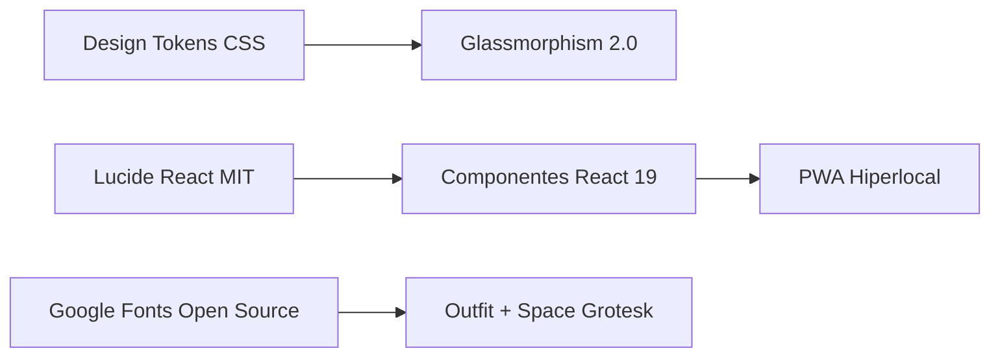

# 🎨 05 - Sistema de Diseño Abierto (Open Design System)

MeteoPrecisa utiliza los principios de **Open Design** (Diseño Abierto y Código Abierto) para garantizar una interfaz accesible, modular y sin dependencias propietarias.

## 🧱 Pilares del Open Design System

### 1. Design Tokens Abiertos (`index.css`)
- **Variables CSS Abiertas**: Escala de colores HSL/HEX centralizada (`--accent-blue`, `--accent-emerald`, `--bg-dark`).
- **Capas Transparentes**: Glassmorphism abierto con `backdrop-filter: blur(28px)`.

### 2. Iconografía Abierta (MIT)
- **Lucide React**: Vectoriales ligeros (Weather, Sprout, Wind, Droplets, ShieldCheck).

### 3. Tipografía Abierta (Google Fonts OFL)
- **Outfit**: Sans-serif limpia para lectura ágil.
- **Space Grotesk**: Monoespaciada técnica para valores numéricos e índices satelitales.

---

> [!NOTE]
> Regresa al [[Index]].
