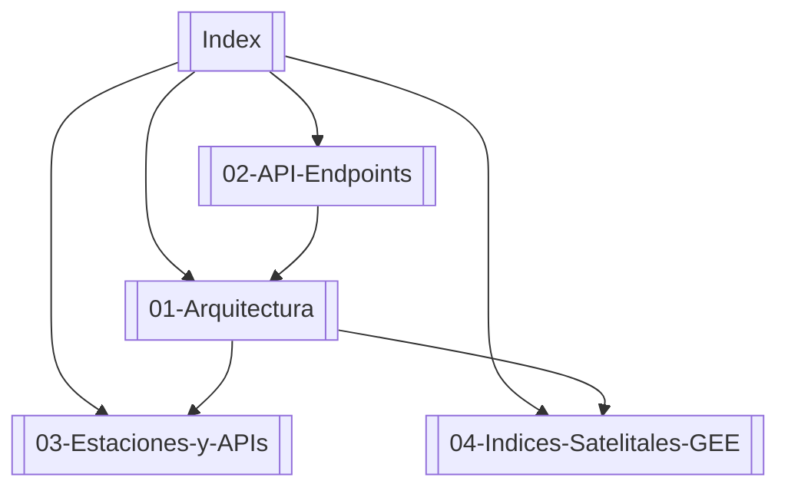

# 🌩️ Bóveda de Conocimiento MeteoPrecisa

Bienvenido a la documentación interactiva de **MeteoPrecisa** formateada para **Obsidian**.

## 🗺️ Mapa de la Bóveda

---

## 📌 Módulos Principales

- [[01-Arquitectura]]: Visión general de componentes de backend (FastAPI), sincronizador en segundo plano y motor de caché RAM.
- [[02-API-Endpoints]]: Catálogo de endpoints de la API en producción.
- [[03-Estaciones-y-APIs]]: Fuentes de datos de entrada (DMC, RedMeteo, SINCA, PurpleAir).
- [[04-Indices-Satelitales-GEE]] - Cálculo de NDVI, ETo FAO-56 y métricas agrometeorológicas.
- [[05-Open-Design-System]] - Sistema de diseño visual Glassmorphism 2.0 y tokens de interfaz.
- [[06-Auditoria-Estaciones]] - Auditoría de captación e ingesta de estaciones (DMC, Agromet INIA, RedMeteo, SINCA).

---

> [!TIP]
> **Navegación Visual**: Presiona `Ctrl + G` en Obsidian para abrir la **Vista de Grafo** interactiva y ver cómo se interconectan estos módulos en tiempo real.
